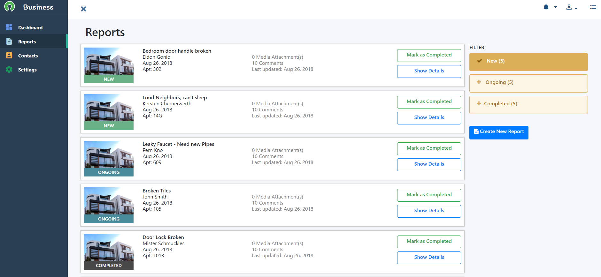
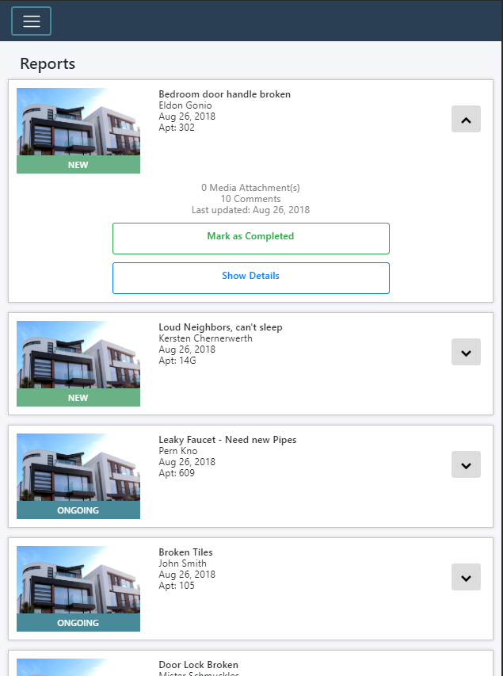
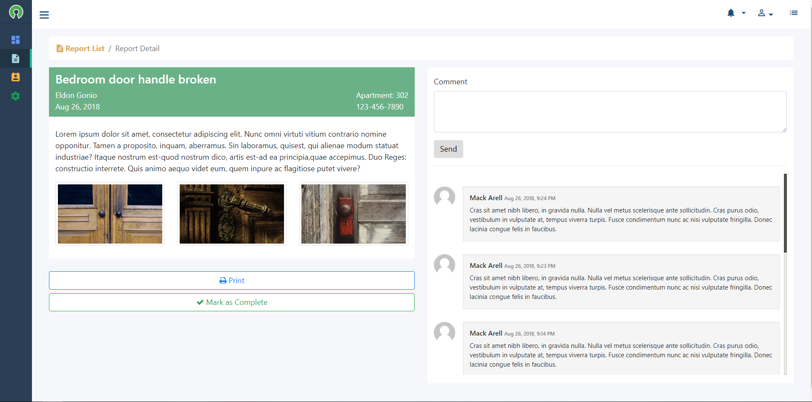

# Simple Dashboard 

A simple web dashboard that runs on Angular 4 and uses Bootstrap, Materials.io
To check a live version, go to  http://www.simpledashboard.com.s3-website-us-east-1.amazonaws.com

## Still a work in progress

Will fill up later...

The idea is for people to use this freely and customize it themselves. 

Planning to add SaSS compatibility for easy colour changes.

### Screenshots

